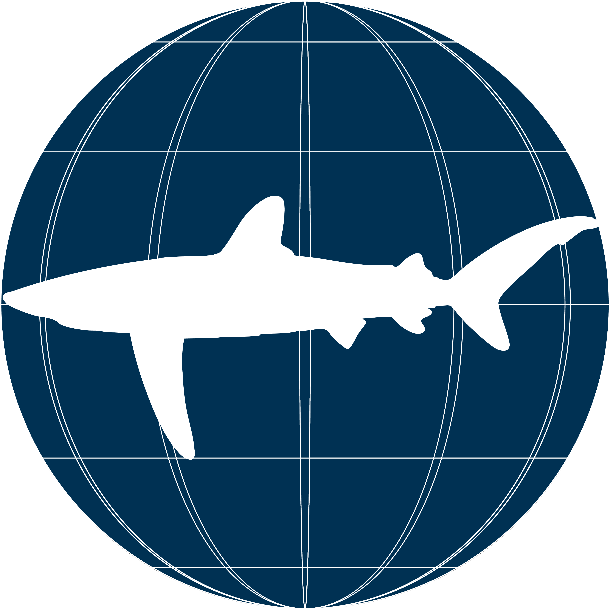
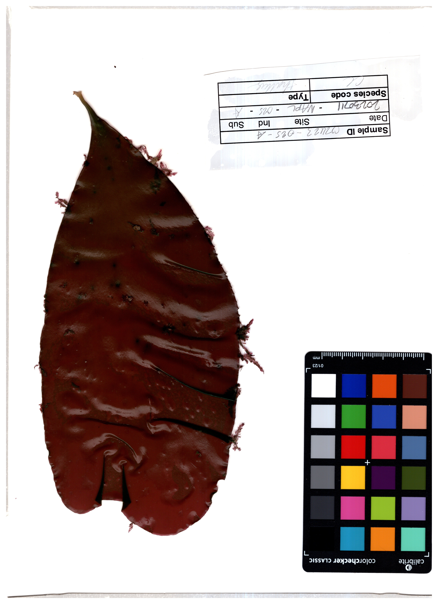
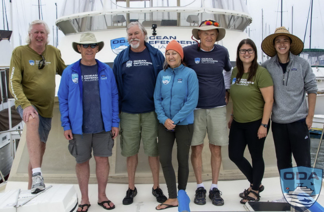
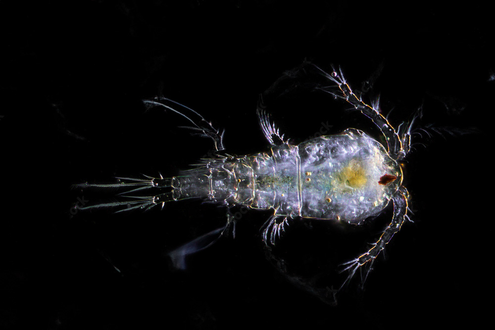

```{=html}

<section class="hv-research-header">
  <div class="hv-research-header-bg"></div>
  <h1>research</h1>
  <p>
    I study species interactions to understand how overlooked pathways can contribute to marine ecosystem resilience. 
  </p>
</section>

<div class="research-list">

  <a class="research-card" href="research/2026-sharkmorphology/index.html">
    <div class="research-card-img">
      
    </div>
    <div class="research-card-body">
      <div class="research-card-title">fin atlas</div>
      <div class="research-card-desc">Shark fin morphometrics for every known extant species.</div>
      <div class="research-card-date">Apr 1, 2026</div>
    </div>
  </a>

  <a class="research-card" href="research/2024-19-12-fisharefriends/index.html">
    <div class="research-card-img">
      
    </div>
    <div class="research-card-body">
      <div class="research-card-title">fish are friends</div>
      <div class="research-card-desc">Fish help corals deal with stress! Full manuscript published in Biology Letters.</div>
      <div class="research-card-date">Dec 24, 2024</div>
    </div>
  </a>

  <a class="research-card" href="research/2023-pastpresentpredictions/index.html">
    <div class="research-card-img">
      
    </div>
    <div class="research-card-body">
      <div class="research-card-title">past, present, predictions</div>
      <div class="research-card-desc">Learning from the past to predict the future of kelp forests.</div>
      <div class="research-card-date">Jul 25, 2023</div>
    </div>
  </a>

  <a class="research-card" href="research/2022-debrisfreeseas/index.html">
    <div class="research-card-img">
      
    </div>
    <div class="research-card-body">
      <div class="research-card-title">debris free seas</div>
      <div class="research-card-desc">Disentangling whale and fisheries entanglement data.</div>
      <div class="research-card-date">May 22, 2023</div>
    </div>
  </a>

  <a class="research-card" href="research/2021-macroinverts/index.html">
    <div class="research-card-img">
      
    </div>
    <div class="research-card-body">
      <div class="research-card-title">macroscopic messengers</div>
      <div class="research-card-desc">Macroinvertebrate population dynamics in Devereaux Slough!</div>
      <div class="research-card-date">May 23, 2022</div>
    </div>
  </a>

</div>

<script>
  const observer = new IntersectionObserver((entries) => {
    entries.forEach((entry) => {
      if (entry.isIntersecting) {
        const delay = Array.from(document.querySelectorAll('.research-card')).indexOf(entry.target) * 180;
        setTimeout(() => entry.target.classList.add('visible'), delay);
        observer.unobserve(entry.target);
      }
    });
  }, { threshold: 0.12 });
  document.querySelectorAll('.research-card').forEach(el => observer.observe(el));
</script>
```
