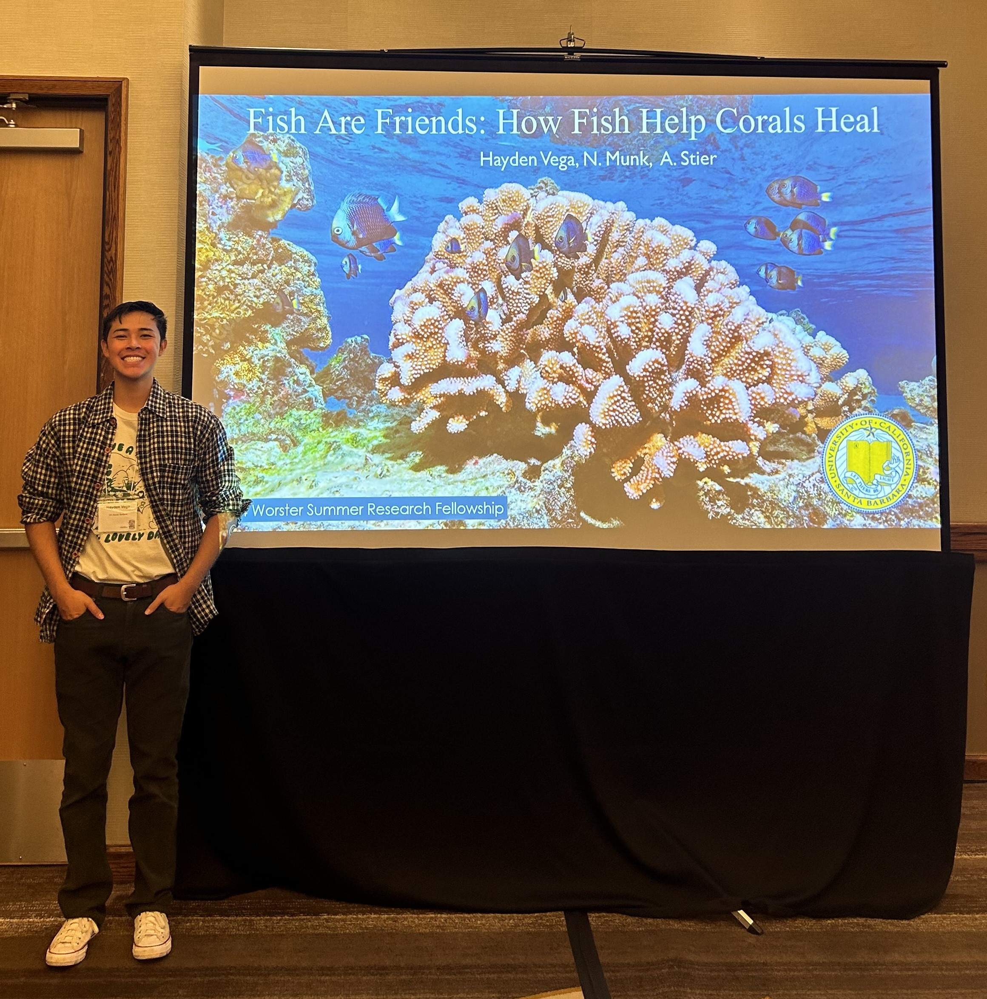
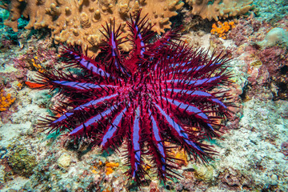
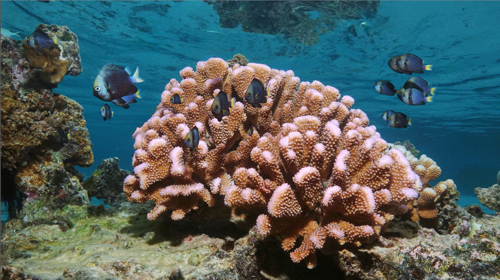
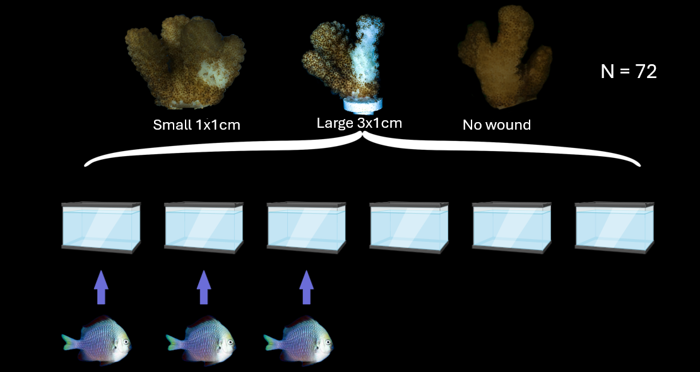
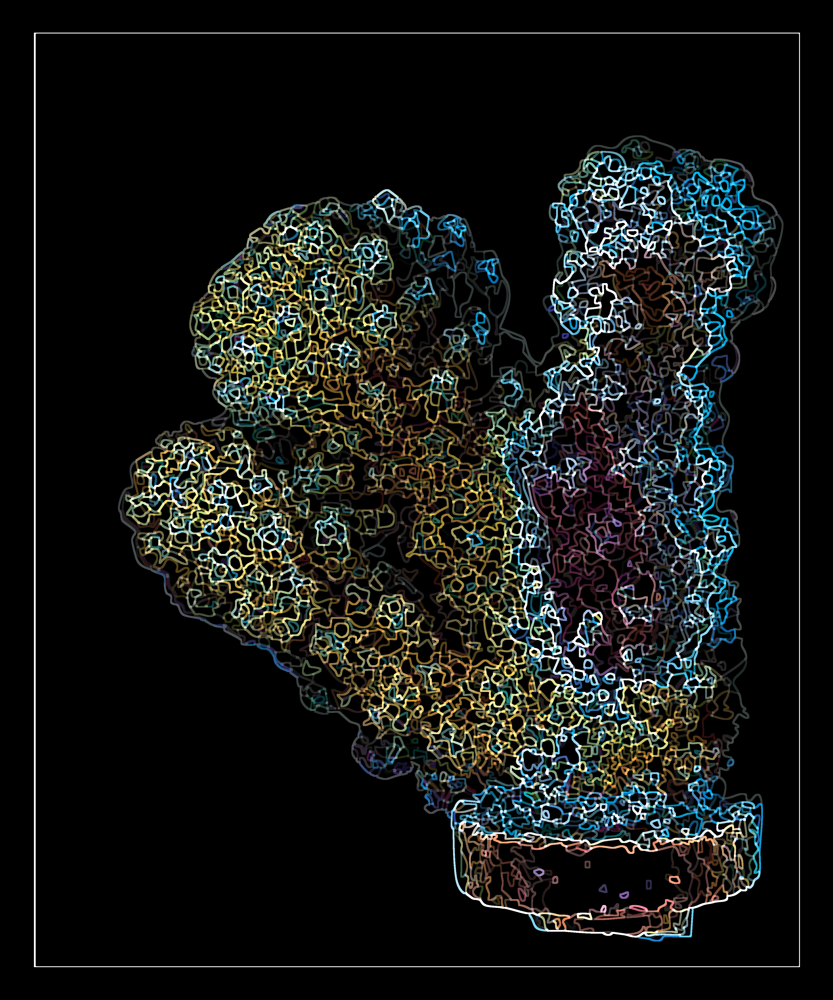

# Summary

Coral reefs are in global decline. As corals face stronger and more frequent disturbances, reef resilience is increasingly recognized as the product of complex interactions between corals, their endosymbiotic algae, and external symbionts such as fishes and invertebrates. While previous studies have documented how coral-associated fishes influence responses to disturbances such as thermal stress, their role in supporting tissue repair remains poorly understood. Here, we experimentally test whether coral-associated fishes facilitate wound healing in the coral Pocillopora spp. We imposed small and large wounds and monitored healing in the presence and absence of coral-dwelling damselfishes (Dascyllus flavicaudus). Corals exposed to fishes exhibited faster wound closure and higher photosynthetic efficiency in recently regenerated tissue, particularly for larger wounds. Our results extend the emerging understanding of coral holobiont resilience, highlighting the importance of external symbionts in sustaining coral recovery from physical disturbances.

## Background: Fish are friends!



Some scientists think that your grandchildren may never see a natural coral reef (Hoegh-Guldberg 2019). Corals are in global decline, and climate change is throwing new stressors at our corals faster than they can adapt. One of these new stressors and an emerging source of coral mortality is wounding (Bright 2015). This refers to the physical breakdown of coral tissue and skeleton, which can be caused by a variety of sources from a carelessly placed anchor to an abandoned fishing net. Yet, the most devastating and prevalent source of coral wounds is from predators.

Wounds are deadly to corals because they strain a coral's physiological machinery. Wounds have been shown to decrease a coral's ability to grow, reproduce, and photosynthesize (Munk 2024).When wounding intensity is high, corals may not have the energy to heal a wound or deal with the strain associated with the damage. Ultimately, this results in an individual's death. Predation pressure and wounding is only predicted to increase with climate change, resulting in a future where predators may kill entire reefs.

Luckily, corals have some pretty good friends in the fight against climate change and wounding. Fish, particularly those who use corals as shelter, have been shown to alleviate strain on a coral's physiological machinery(Shantz 2023). Fish have been shown to increase a coral's ability to grow, reproduce, and photosynthesize. Fish help corals make more energy by providing nutrients through excretion and increasing the waterflow around the coral(Shantz 2023).

Our experiment is interested in elucidating how coral health changes as a function of wounding intensity and fish presence. We studied this relationship in a tank experiment. We collected 72 *Pocillopora sp.* corals and gave them either no, small, or a large wound. We then spread equal numbers of each wounding treatment into six tanks (12 corals/tank). The coral sheltering fish, the Yellowtail Dascyllus (*Dascyllus flavicaudus*) was added (36 grams of biomass) to half of these tanks. Corals were housed in treatment tanks for three weeks, and all physiological data was collected at the end. To assess wound healing, we measured the initial and final size of wounds and divided the difference of the two by the duration of the experiment (21 days). To assess physiological responses to fish and wounding, we measured growth and photosynthetic efficiency of all corals.

## Analysis

To analyze fish and wound effects on healing rate, growth, and photosynthetic efficiency, we fit our data to mixed-effects models. We tested the significance of these effects and their interactions using likelihood ratio tests to compare nested models fitted by maximum likelihood. 

## Results & Discussion

We saw a significant, positive effect of fish on both wound healing rate and photosynthetic efficiency. 

We did not observe a significant effect of fish or wounds on coral growth, but this likely reflects the short duration of our experiment rather than the absence of an effect. 

Our results contribute to the emerging perspective that coral-associated fishes enhance coral holobiont resilience by adding the facilitation of tissue regeneration to the previously established roles of fishes in promoting coral growth and increasing thermal tolerance(22, 31). By demonstrating that damselfishes actively facilitate coral regeneration following injury, we underscore the functional importance of external symbiotic relationships in buffering corals from both chronic stressors and acute physical disturbances. Preserving these ecological partnerships will likely be crucial for sustaining coral regenerative capacity and enhancing long-term reef resilience.

## Figures

![Figure 1. Damselfish presence accelerated coral wound healing, particularly for large wounds. Wound healing rate (cm²/day) in fragments of Pocillopora as a function of wound size and fish presence. Small circles represent individual coral fragments (n = 8 per treatment); large circles indicate treatment means with vertical bars showing 95% confidence intervals. Corals with resident damselfish (blue, filled circles) exhibited higher healing rates than fish-absent controls (orange, open circles) across both wound size treatments. This effect was most pronounced in corals with large wounds, where corals with fish healed at approximately twice the rate of corals without fish.](summary_line_healing_rate_by_wound_fish.png)

![Figure 2. Effects of damselfish on coral growth rate and photosynthetic efficiency across wound treatments. (A) Coral skeletal growth rate (mg day⁻¹cm⁻² ) and (B) maximum quantum yield of photosystem II (Fv/Fm) measured in fragments of Pocillopora exposed to three wound size treatments (No Wound, Small, Large) in the presence (blue, filled circles) or absence (orange, open circles) of Dascyllus damselfish. Small circles represent individual coral fragments; large circles indicate treatment means ± 95% confidence intervals. (A) Growth rates were similar across all treatments. (B) Fish presence had minimal effect on photosynthetic efficiency in unwounded corals, but enhanced Fv/Fm in wounded corals, with the largest difference observed in corals with large wounds. Corals without fish showed reduced Fv/Fm in wounded treatments, particularly in the large wound treatment where corals without fish exhibited the lowest photosynthetic efficiency.](combined_growth_pam_figure.png)

## Video and Photos

{group="photos"}

{group="photos"}

{group="photos"}

{group="photos"}

##### *Bibliography*

Bright, A. J., Cameron, C. M., & Miller, M. W. (2015). Enhanced susceptibility to predation in corals of compromised condition. PeerJ, 3, e1239.

Hoegh-Guldberg, O., Pendleton, L., & Kaup, A. (2019). People and the changing nature of coral reefs. Regional Studies in Marine Science, 30, 100699.

Munk, N. J. (2024). Host and Symbiont Physiology During Wound Regeneration in Acropora pulchra Under Warming Conditions (Master's thesis, University of California, Santa Barbara).

Shantz, A. A., Ladd, M. C., Ezzat, L., Schmitt, R. J., Holbrook, S. J., Schmeltzer, E., ... & Burkepile, D. E. (2023). Positive interactions between corals and damselfish increase coral resistance to temperature stress. Global Change Biology, 29(2), 417-431.