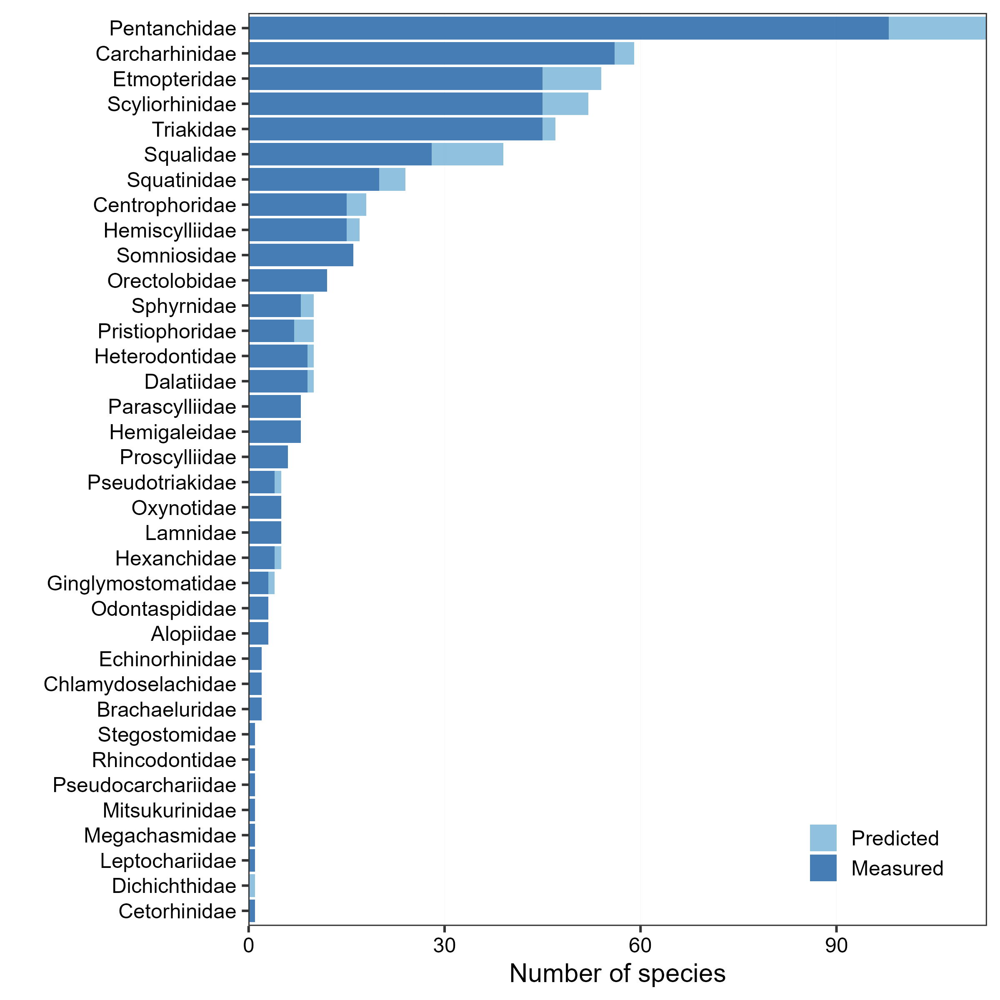
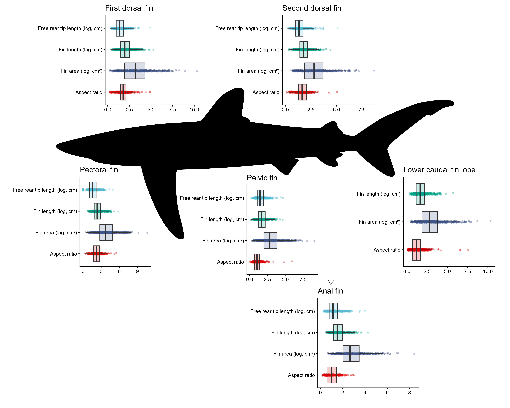

# Summary

Sharks are among the most ecologically successful groups of vertebrates. Fins enabled sharks to thrive for millions of years, but have now become commercial targets, thus driving mortality to supply the shark fin trade. Despite decades of exploitation, fin morphometric and morphological data are scarce, curtailing research on shark conservation, ecology, and evolution. Here, we introduce Fin Atlas, a dataset of fin morphometrics for all 557 extant valid shark species. We used imaging software to extract fin area, length, and free rear tip length for all fins from the scaled pictographs of 490 valid species published in the 2013 edition of Sharks of the World: A Fully Illustrated Guide. We then used random forest regression models to estimate each measurement for the 67 species described afterwards. For all fins and species, we calculated fin aspect ratio, a shape metric used in ecomorphological analyses. Fin Atlas will enable researchers to answer questions on fin desirability for the fin trade, and ecological and evolutionary analyses on shark morphology and movement. 

## Background: Fish are friends!



Some scientists think that your grandchildren may never see a natural coral reef (Hoegh-Guldberg 2019). Corals are in global decline, and climate change is throwing new stressors at our corals faster than they can adapt. One of these new stressors and an emerging source of coral mortality is wounding (Bright 2015). This refers to the physical breakdown of coral tissue and skeleton, which can be caused by a variety of sources from a carelessly placed anchor to an abandoned fishing net. Yet, the most devastating and prevalent source of coral wounds is from predators.

