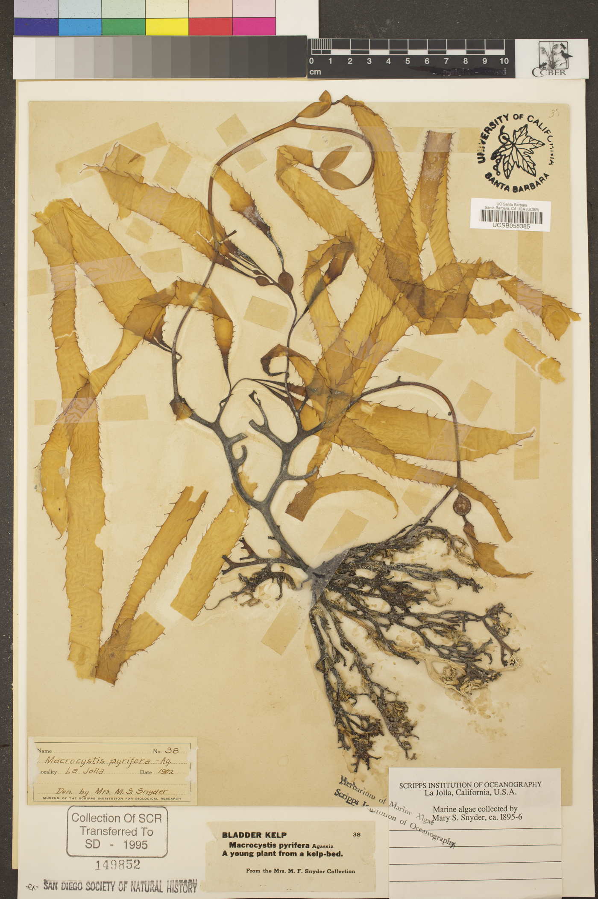
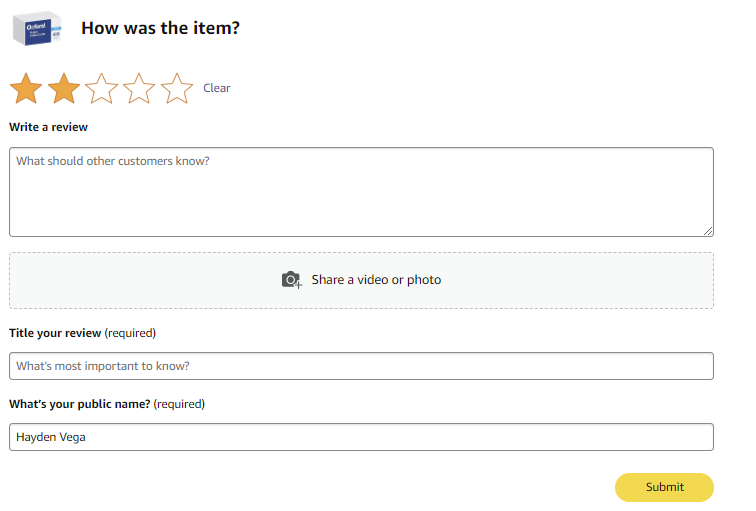
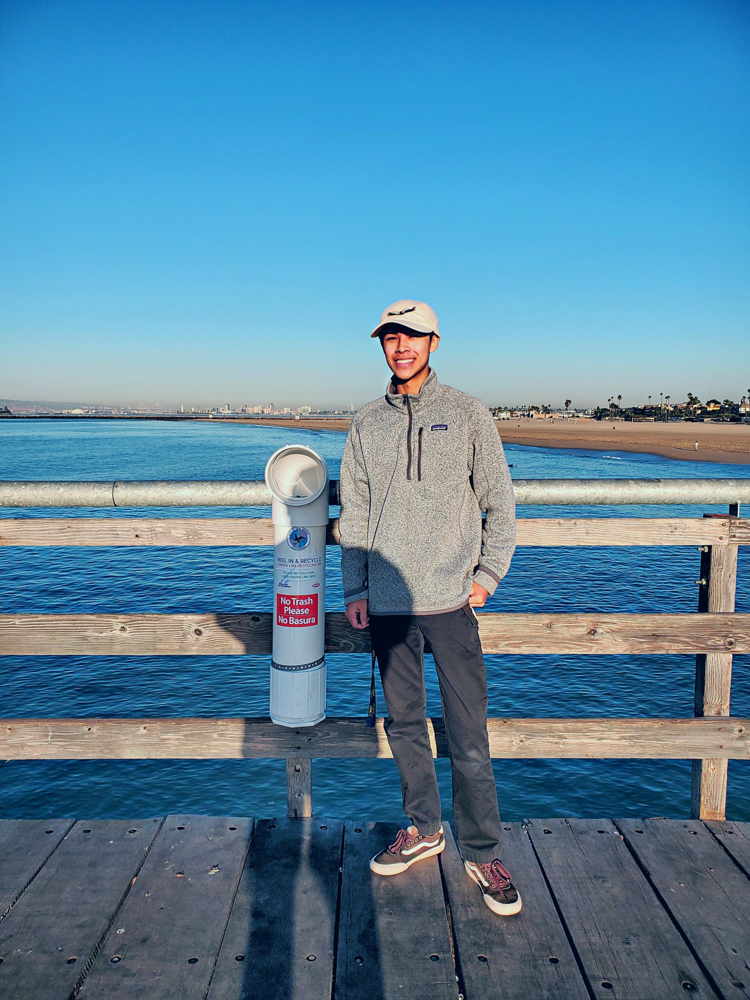
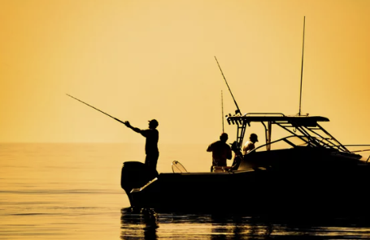

```{=html}
<section class="hv-research-header">
  <div class="hv-research-header-bg" style="background-image: url('images/bwrise.jpg');"></div>
  <h1>words</h1>
  <p>
    A fried-rice of leftover words about nature, the ocean, and my life that I've cooked up especially for you.
  </p>
</section>

<div class="research-list">

  <a class="research-card" href="words_posts/eds_240_blog/index.html">
    <div class="research-card-img">
      
    </div>
    <div class="research-card-body">
      <div class="research-card-title">visualizing the past, present, and predictions</div>
      <div class="research-card-desc">Learning the art of data science.</div>
      <div class="research-card-date">Mar 13, 2025</div>
    </div>
  </a>

  <a class="research-card" href="words_posts/flashcard_review/index.html">
    <div class="research-card-img">
      
    </div>
    <div class="research-card-body">
      <div class="research-card-title">flashcard review</div>
      <div class="research-card-desc">A story, not about flashcards, but rather navigating pride, pressure, and personal loss.</div>
      <div class="research-card-date">Jan 26, 2025</div>
    </div>
  </a>

  <a class="research-card" href="words_posts/fishing_line/index.html">
    <div class="research-card-img">
      
    </div>
    <div class="research-card-body">
      <div class="research-card-title">bringing fishing line recycling to Seal Beach</div>
      <div class="research-card-desc">How and why I started a fishing line recycling program. Originally published through the OC Coastkeeper website.</div>
      <div class="research-card-date">Jan 23, 2021</div>
    </div>
  </a>

  <a class="research-card" href="words_posts/boating/index.html">
    <div class="research-card-img">
      
    </div>
    <div class="research-card-body">
      <div class="research-card-title">safe boating & fishing</div>
      <div class="research-card-desc">A page turner about boating maintenance and fishing line recycling. Originally published through the OC Coastkeeper website.</div>
      <div class="research-card-date">Jan 21, 2021</div>
    </div>
  </a>

</div>

<script>
  const observer = new IntersectionObserver((entries) => {
    entries.forEach((entry) => {
      if (entry.isIntersecting) {
        const delay = Array.from(document.querySelectorAll('.research-card')).indexOf(entry.target) * 180;
        setTimeout(() => entry.target.classList.add('visible'), delay);
        observer.unobserve(entry.target);
      }
    });
  }, { threshold: 0.12 });
  document.querySelectorAll('.research-card').forEach(el => observer.observe(el));
</script>
```
